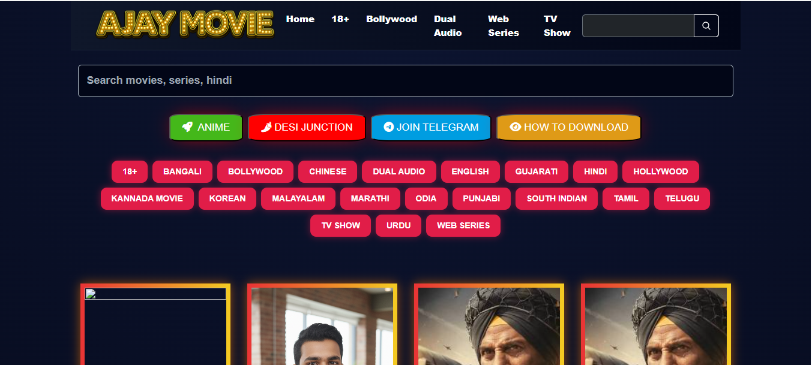
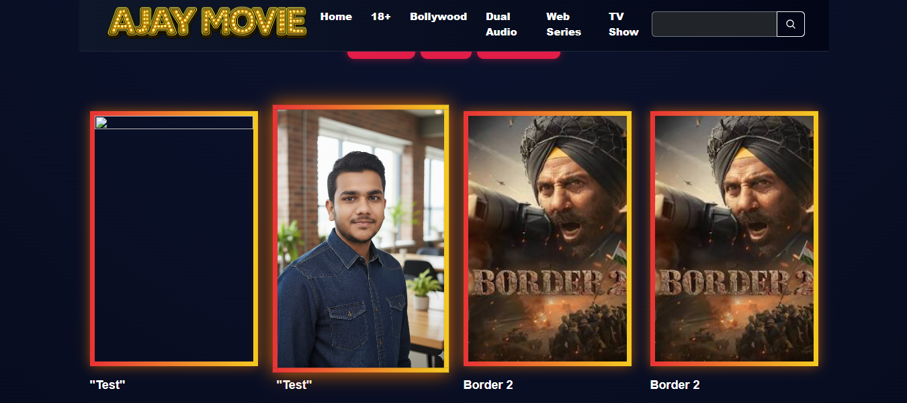

# 🎬 Ajay Movies Platform  
**A Production-Ready Full-Stack Movie Catalog & Download System**

Ajay Movies is a **professional-grade full-stack web application** built to manage, showcase, and distribute digital media content in a clean, scalable, and business-ready way.  
It combines a **Netflix-style user experience** with a **powerful admin system** capable of handling complex data relationships and secure file uploads.

This project is designed not as a tutorial demo, but as a **real-world solution** that can be adapted for media companies, content creators, and digital product businesses.

---

## 1️⃣ Project Overview (Instant Clarity)

### ❓ The Problem  
Generic CMS platforms fail when it comes to:
- Managing multiple video qualities (480p / 720p / 1080p)
- Handling bulk media uploads (posters + screenshots)
- Structuring metadata for search, SEO, and performance
- Providing a premium browsing experience

### ✅ The Solution  
**Ajay Movies** solves this by offering:
- A **user-friendly frontend** for browsing and downloading content
- A **robust admin dashboard** for managing movies, media assets, and metadata
- A **clean backend architecture** built for scalability and maintainability

### 👥 Who This Is For
- Media & movie distribution platforms  
- Content creators & niche OTT websites  
- Businesses needing **digital asset management systems**  
- Freelance clients who want a **custom Netflix-style website**

### 🌍 Real-World Use Case (Non-Technical)
A business owner can upload a movie once, attach posters, screenshots, multiple download qualities, and instantly make it available on a professional website that users trust.

---

## 2️⃣ Live Demo

> 🚧 This project is currently under active development and runs locally.

**Frontend:**  
http://localhost:4200

**Backend API:**  
http://localhost:8080/api

### What Users Can Do
- Browse movies in a responsive poster grid  
- Search and explore detailed movie pages  
- View screenshots before downloading  
- Download movies in different quality formats  

### Why the UI/UX Feels Professional
- Clean dark-mode design to reduce eye strain  
- Clear information hierarchy for fast decision-making  
- Visual validation (screenshots + specs) before download  

---

## 3️⃣ Key Features (Value-Focused)

### 🏢 Business-Oriented Features
- **Multi-Quality Distribution:** 480p, 720p, 1080p download support  
- **SEO-Ready Structure:** Semantic HTML & metadata placement  
- **Social Sharing:** WhatsApp, Telegram, LinkedIn integration  
- **Admin Control:** Full control over content without developer help  

### ⚙️ Technical Features
- **Modern Angular Architecture:** Standalone Components + Signals  
- **Reactive Forms:** Advanced validation for admin data integrity  
- **Multipart Upload Handling:** JSON + images in a single request  
- **Responsive Design:** Works flawlessly on mobile to 4K screens
- **Animated UI Components:** Smooth entrance animations and micro-interactions
- **Glassmorphism Design:** Modern visual effects with backdrop blur
- **Mobile-First Approach:** Optimized hamburger menu with elegant close button  

### 🔐 Security & Performance
- Server-side validation  
- Clean REST API design  
- Controlled static file serving  
- Optimized database relationships  

> ❗ This is **not** a basic CRUD or tutorial project.  
It demonstrates real production-level problem solving.

---

## 4️⃣ Tech Stack (With Purpose)

| Technology | Why It Was Chosen |
|----------|------------------|
| **Angular 17+** | Modern, scalable frontend with strict typing |
| **TypeScript 5** | Prevents runtime errors, improves maintainability |
| **RxJS** | Efficient async data handling |
| **SCSS + Bootstrap 5** | Custom design with responsive grid system |
| **Spring Boot 3** | Enterprise-grade backend framework |
| **Spring Data JPA** | Clean database abstraction |
| **MySQL** | Structured, relational data storage |

---

## 5️⃣ System Architecture (Simple)

### High-Level Flow
```
User Interface (Angular) → REST API (Spring Boot) → Database (MySQL) → File System
```

### API Design
- `POST /api/save-movie` → Upload movie + media assets  
- `GET /api/get-all-movies` → Fetch movie listings  
- `GET /api/get-by-id/{id}` → Detailed movie view  

### Data Flow
1. Admin fills movie form  
2. Angular sends **FormData (JSON + Images)**  
3. Backend stores metadata in DB  
4. Images stored securely on server  
5. Frontend loads assets via mapped URLs  

---

## 6️⃣ Screenshots / UI Explanation

> 📷 **Preview Screenshots:** Check the `/preview` folder in the repository for detailed UI screenshots

### 🏠 Home Page

- Dark gradient theme for premium look  
- Hover effects signal interactivity  
- Fast visual scanning using poster cards
- Responsive grid layout with smooth animations

### 📥 Movie Detail Page

- Highlights quality, language, and size  
- Dynamic screenshot gallery builds user trust  
- Clear download actions with multiple quality options
- Social sharing integration

### 🔐 Admin Login Page

- **Cinematic Design:** Movie-themed background with overlay effects
- **Animated Branding:** Sequential text animations with gradient effects
- **Modern Form Design:** Floating labels and glassmorphism styling
- **Responsive Layout:** Optimized for all screen sizes

### 🛠️ Admin Dashboard

- **File Upload System:** Drag-and-drop poster and screenshot management
- **Real-time Validation:** Instant feedback for form inputs
- **Content Management:** Streamlined workflow for movie catalog updates  

---

## 7️⃣ Setup & Installation

### Prerequisites
- Node.js v18+  
- Java JDK 17+  
- MySQL Server  

### Frontend Setup
```bash
git clone https://github.com/ankitdoi-coder/ajay-movies.git
cd FrontEnd
npm install
ng serve
```

### Backend Setup
Configure application.properties with MySQL credentials

Run via IDE or:
```bash
cd ajayMoviesBackend
mvn spring-boot:run
```

---

## 8️⃣ Challenges & Learnings (Senior-Level Insight)

### 1. Multipart Mixed Uploads
**Challenge:** JSON + image files in one request  
**Solution:** Used FormData with JSON Blob + files, handled via @RequestPart

### 2. Modern Angular Migration
**Challenge:** Removing NgModule boilerplate  
**Solution:** Adopted bootstrapApplication and standalone components

### 3. Secure Asset Serving
**Challenge:** Serving uploaded images without cloud storage  
**Solution:** Spring Boot static resource mapping with controlled access

### 4. Admin Login Page Design
**Challenge:** Creating a professional, cinematic login experience  
**Solution:** Implemented glassmorphism design with animated text sequences, responsive layout, and modern UI patterns

### What This Proves
- I can design real-world architectures
- I understand production constraints
- I write maintainable, scalable code

---

## 9️⃣ Future Enhancements

### 🔒 Authentication & Security
- **JWT Authentication:** Secure admin login system (in development)
- **Role-based Access Control:** Different permission levels for admins
- **Session Management:** Secure token handling and refresh

### ☁️ Infrastructure & Performance
- Cloud storage integration (AWS S3 / Firebase)
- Advanced filtering (Genre, Year, Language)
- Image lazy loading for better performance
- CDN integration for global content delivery

### 📱 User Experience
- User accounts & personal watchlists
- Advanced search with filters
- Movie recommendations engine
- Progressive Web App (PWA) features

---

## 🔟 About the Developer (Conversion Section)

Hi, I'm **Ankit Kumar Gurjar**, a Full-Stack Java Developer specializing in building business-ready web applications, not just demos.

### What I Bring
- Clean backend architecture (Spring Boot)
- Modern frontend design (Angular)
- Scalable, maintainable code
- Real-world problem solving mindset

### Open To
- Freelance projects
- Custom website development
- Full-stack application builds
- Long-term collaborations

---

## 1️⃣1️⃣ Contact & Portfolio

**GitHub:** https://github.com/ankitdoi-coder

**LinkedIn:** https://linkedin.com/in/ankit--gurjar

**Email:** ankitdoi82@gmail.com

**WhatsApp:** +91 9352134907

💼 Want a website like this for your business or idea?  
📲 Contact me directly on WhatsApp for fast discussion and custom development.

---

## 🚀 Final Note

This project reflects my ability to deliver production-ready systems that balance logic, performance, and design.

If you're a recruiter or client looking for someone who can handle both backend complexity and frontend experience —  
**Let's build something powerful together.**
